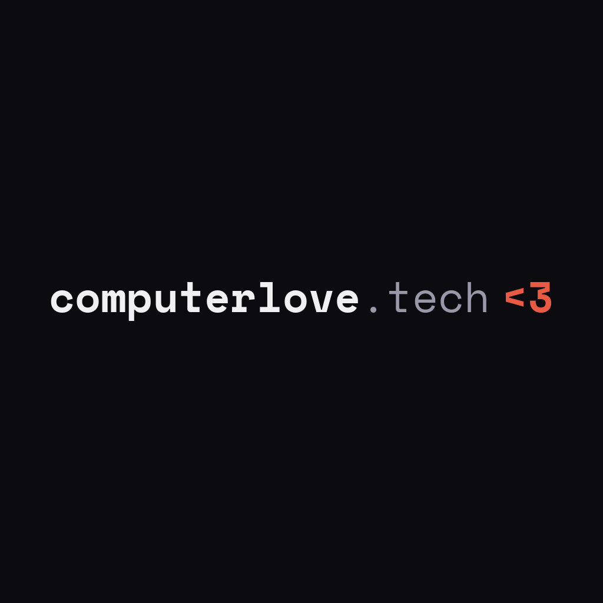

<p align="center">
  
</p>

<h1 align="center">Computer Love</h1>

<p align="center">
  <strong>From prompts to production.</strong><br />
  Agentic engineering for real codebases.
</p>

<p align="center">
  <a href="https://computerlove.tech">Website</a>
  ·
  <a href="https://computerlove.tech/#services">Services</a>
  ·
  <a href="https://computerlove.tech/blog">Writing</a>
  ·
  <a href="https://computerlove.tech/#contact">Contact</a>
</p>

---

We are a Copenhagen-based engineering company helping teams ship real software with AI — not just prototypes.

Our work sits where product engineering, developer experience, open source, and coding agents meet. We build tools, teach teams, and improve the feedback systems that make agentic development safe on complex codebases.

## What we care about

- **Agentic engineering**: practical workflows for Cursor, Claude Code, GitHub Copilot, and custom agents.
- **Harness engineering**: tests, CI, observability, architecture checks, and local environments that agents can actually use.
- **Open source**: small, useful building blocks for teams adopting AI-assisted software delivery.
- **Developer experience**: less ceremony, faster feedback, better defaults.

## For developers

If you are exploring our repositories, start with the README in each project. We try to keep projects practical, documented, and easy to run locally.

A good Computer Love project should make it clear:

```text
$ install dependencies
$ run checks
$ start hacking
$ ship with confidence
```

## Work with us

We run hands-on workshops, speaking sessions, and consulting engagements for teams moving from AI demos to production delivery.

- Workshops for engineering teams
- Agentic coding workflows for existing codebases
- Feedback-system and delivery-harness improvements
- Internal enablement for AI-assisted software development

Visit **[computerlove.tech](https://computerlove.tech)** to learn more.

---

<p align="center">
  <sub>Made with care in Copenhagen · computerlove.tech</sub>
</p>
